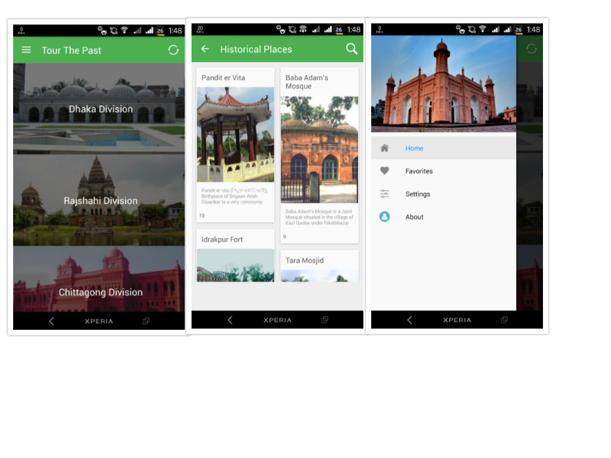

# Tour The Past
>This is an Android app for knowing user nearby historical place.
User can get information about historical place details, history, opening hour to visit.

## Installation

## Release History

* 1.0.1
